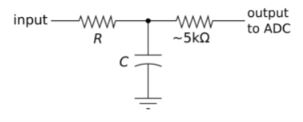
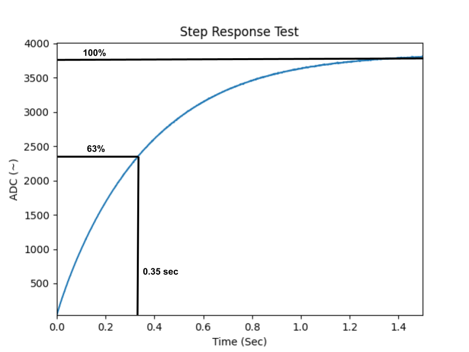

# me405_lab4
## Description:
This repository is for Lab 4 in the ME-405 class to test a RC circuits step response.
Please install all the files in src onto the MicroPython Board except for pc_com.py.
Run main.py on the MicroPython Board and then pc_com.py on the PC to connect the communication and data.
*May need to adjust the COMS port number in the pc_com.py file*

### RC Circuit
The goal of this experiment is to create a simple RC circuit shown below to recreate a first-order circuit response.

### Step Response Test
The main file will conduct a step response test with the RC circuit to find the time constant to ensure the electronic components are within manufactured tolerance.

Below is the step response tests results using a 100KOhm resistor and a 3.5uF capacitor ran over the course of 1.5 seconds:

Figure 1 shows that the time constant is around 0.35 seconds by taking time time at 63% of the constant ADC value.
Using the labeled component values T = RxC = 100KOhm x 3.5uF = 0.35sec
The comparison shows zero percent difference which is probably due to our test not being conducted longer to find a better leveled value.

Figure 1. RC Circuit Response Test

